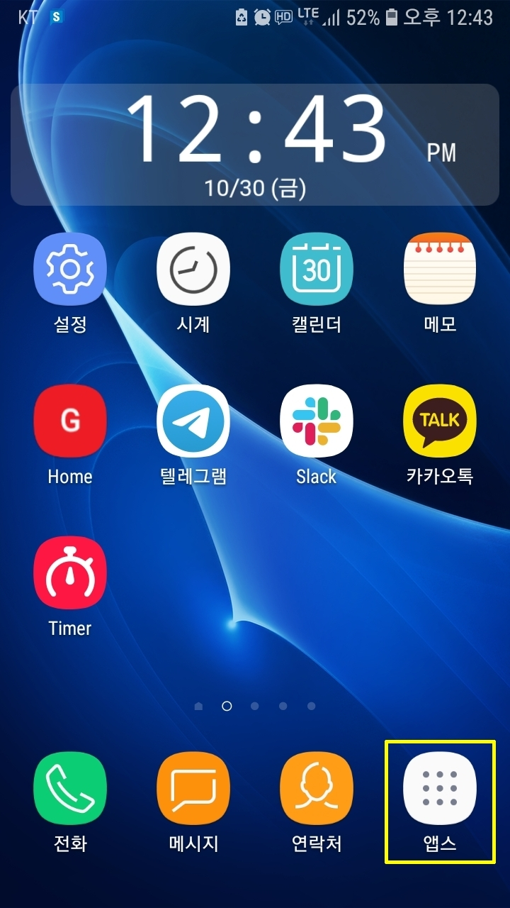
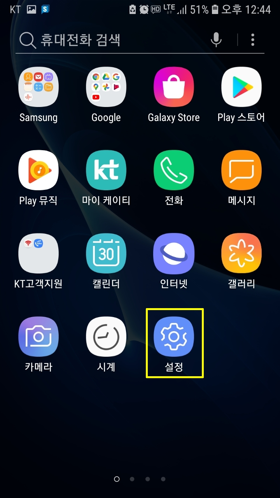
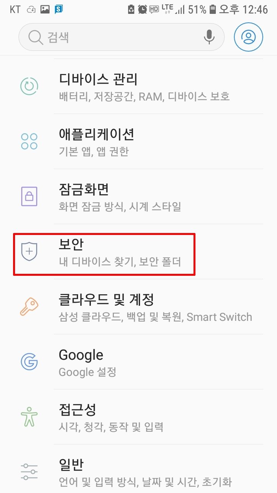
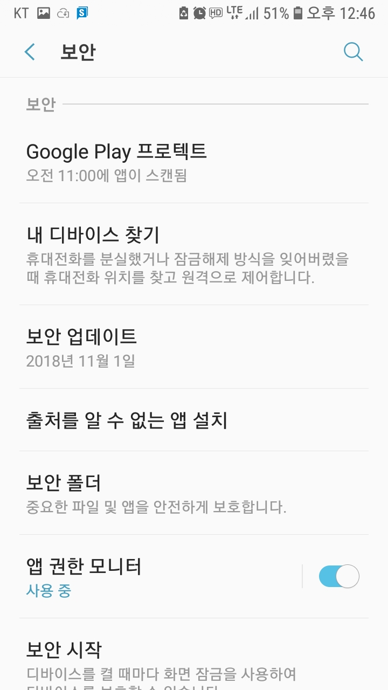
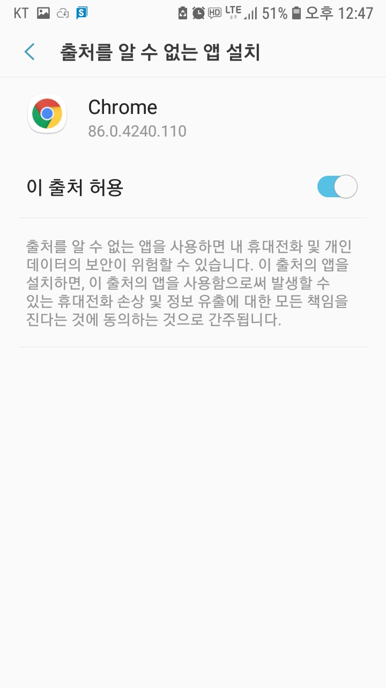
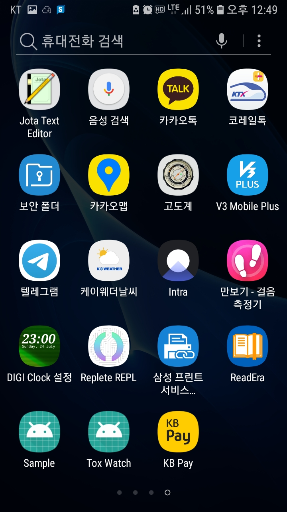

= Tox Watch Test
:sectnums:

* 현재는 안드로이드용 앱만 제공합니다.

* 아이폰 앱을 제공할지 여부는 아직 정해지지 않았습니다.

== 안드로이드 사전 설정

. 화면 하단 우측의 [앱스] 아이콘을 선택합니다.
+

. [설정] 아이콘을 선택합니다. 이 아이콘이 안보이면 좌우로 화면을 이동해 가며 찾습니다.
+

. [보안]을 선택합니다.
+

. [출처를 알 수 없는 앱 설치]를 선택합니다.
+

. 이때 나열되는 앱들 중에서 자신이 자주 사용하는 브라우저를 선택합니다. 이 예에서는
  Chrome을 선택합니다.
+
image::img/chrome.jpg[width=300]

. [이 출처 허용]을 활성화합니다.
+

== 설치 및 실행

* 안드로이드 폰에서 위에서  선택한 브라우저를 실행한 후, 이 사이트를 재방문해 아래의
  다운로드 링크를 클릭하면 자동으로 설치가 진행욉니다

=== 다운로드

* link:build/toxwatch-20201030.apk[toxwatch-20201030.apk] (10.6MB)

* 다음과 같은 내용의 페이지가 뜨는 경우에는, 그 위의 `Download` 버튼을 클릭합니다.
+
image::img/download.jpg[width=300]

=== 실행 

. 화면 하단 우측의 [앱스] 아이콘을 선택합니다.
+

. [Tox Watch] 아이콘을 찾아 선택하면 앱이 실행됩니다. 이 아이콘이 안보이면 좌우로 화면을
  이동해 가며 찾습니다.
+

== 테스트시 유의 사항

* 이번 버전은 최초의 테스트 버전이어서 구현된 기능이 완벽하지 않습니다.

* 이번 버전에서는 세세한 기능보다는 전체적인 화면의 내용과 디자인 그리고 화면 간의
  연계성에 주목해서 추가/삭제해야 할 내용들 위주로 검토해 주시기 바랍니다.

* 테스트의 편의를 위해 각 화면의 입력 항목의 값들에 대한 검사는 현재 수행하지 않고
  있습니다. 다시 말해, 각 화면의 필수 입력 항목들을 모두 입력하지 않아도 이번 버전에서는
  화면 사이의 자유로운 전환이 허용됩니다.

=== 현재까지 제기된 문제점들

* 광고문구 제출 후, 성공/실패 화면은 메시지 박스가 아닌 다른 방식으로의 전환이 필요하다.

* 광고 문구 제출후, 나오는 선택 메시지 박스에서 [새 광고문구 입력]을 선택하면, 기존
  입력한 데이타들이 그대로 잔존해 있다.

* 앱 종료후 재실행하면 [장소] 입력창에 기존에 입력한 데이터가 잔존해 있다.

* 화면 상단 우측에 메뉴 아이콘을 추가할 필요가 있다.
** 추가할 메뉴 항목: 제품사진 리스트 / 광고문구 사진 리스트